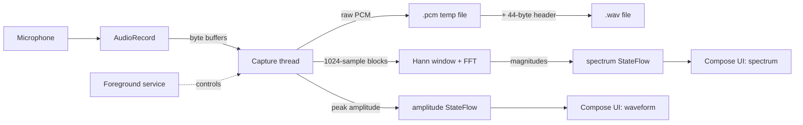

# RawAudioRecorder

A production-style Android app that captures **raw PCM audio** directly from the microphone using the low-level `android.media.AudioRecord` API, writes playable WAV files, and visualizes the signal in real time with a live waveform and a custom FFT spectrum analyzer.

Built with Kotlin and Jetpack Compose, the app demonstrates low-level audio capture, manual buffer management, background-safe recording via a foreground service, and on-device digital signal processing.

---

## Features

- **Raw microphone capture** with `AudioRecord` (44,100 Hz, mono, 16-bit PCM) — no high-level wrappers.
- **Manual buffer management** on a dedicated background thread, so the blocking `read()` never stalls the UI.
- **WAV file export** — raw headerless PCM is written to disk, then wrapped with a hand-built 44-byte WAV header to produce a playable file.
- **Background-safe recording** through a microphone-type foreground service with a persistent notification, so capture survives the app being backgrounded.
- **Live waveform** drawn on a Jetpack Compose `Canvas` from per-buffer peak amplitude.
- **Live frequency spectrum** powered by a from-scratch radix-2 FFT with a Hann window.

---

## Screenshots

> Replace these with your own captures (drop the images into a `/screenshots` folder in the repo).

| Recording with waveform | Live FFT spectrum | Foreground notification |
|---|---|---|
| `screenshots/waveform.png` | `screenshots/spectrum.png` | `screenshots/notification.png` |

---

## Tech stack

- **Language:** Kotlin
- **UI:** Jetpack Compose (Material 3)
- **Audio:** `android.media.AudioRecord`
- **Concurrency:** Background capture thread + `StateFlow` for thread-safe UI updates
- **DSP:** Custom radix-2 Cooley–Tukey FFT
- **Min SDK:** 24 · **Target:** Android 14+ (foreground service typing)

---

## How it works

The capture loop reads byte buffers from `AudioRecord` on a worker thread. Each buffer is written straight to a temporary PCM file, scanned for peak amplitude (for the waveform), and fed into a 1,024-sample accumulator for FFT analysis. Two `StateFlow`s carry the amplitude and spectrum back to the Compose UI on the main thread. A foreground service owns the recording so it continues while the app is backgrounded, and on stop the PCM is converted into a standard WAV file.

---

## Project structure

| File | Responsibility |
|---|---|
| `AudioCapture.kt` | Core engine: `AudioRecord` setup, capture loop, buffer-to-WAV writing, FFT feeding |
| `Fft.kt` | In-place radix-2 Cooley–Tukey FFT |
| `RecordingService.kt` | Microphone foreground service + notification |
| `RecorderHolder.kt` | Singleton holding the shared `AudioCapture` instance |
| `MainActivity.kt` | Compose UI, runtime permissions, service commands, waveform + spectrum views |
| `AndroidManifest.xml` | `RECORD_AUDIO`, foreground-service permissions, service declaration |

---

## Key technical concepts demonstrated

- **Digital audio fundamentals:** sample rate, bit depth, channel configuration, and PCM encoding.
- **Low-level buffer handling:** sizing buffers from `getMinBufferSize()`, reading on a background thread, and avoiding dropped samples.
- **The WAV container format:** constructing the RIFF/`fmt `/`data` header by hand for headerless PCM.
- **Android concurrency:** a `@Volatile` stop flag and `Thread.join()` for clean start/stop, plus `StateFlow` to safely cross from the audio thread to the UI thread.
- **Modern foreground services:** the `microphone` service type, `FOREGROUND_SERVICE_MICROPHONE` permission, and the rule that mic services must be started while the app is in the foreground.
- **Signal processing:** windowing and a self-implemented FFT to turn time-domain samples into a frequency spectrum.

---

## Build & run

1. Clone the repo and open it in **Android Studio**.
2. Connect a **physical device** (the emulator's microphone is unreliable).
3. Press **Run**. Grant the microphone and notification permissions on first launch.
4. Tap **Start Recording**, watch the waveform and spectrum, then **Stop** to save a `.wav`.

Recordings are saved to the app's external files directory:
`/Android/data/<package>/files/recording_<timestamp>.wav`

---

## Known limitations & future improvements

- The file write and FFT currently run on the capture thread. A fully production design would hand buffers to a separate writer thread via a producer/consumer queue so disk I/O and DSP can never delay the audio read.
- The WAV header is fixed to the mono/16-bit/44.1 kHz configuration; a general version would derive every field from the active settings.
- The spectrum uses a linear frequency axis; a logarithmic axis would better match human pitch perception.
- Sample rate is fixed; a settings screen could expose configurable rates with graceful fallback on unsupported devices.

---

## License

MIT — free to use and adapt.
